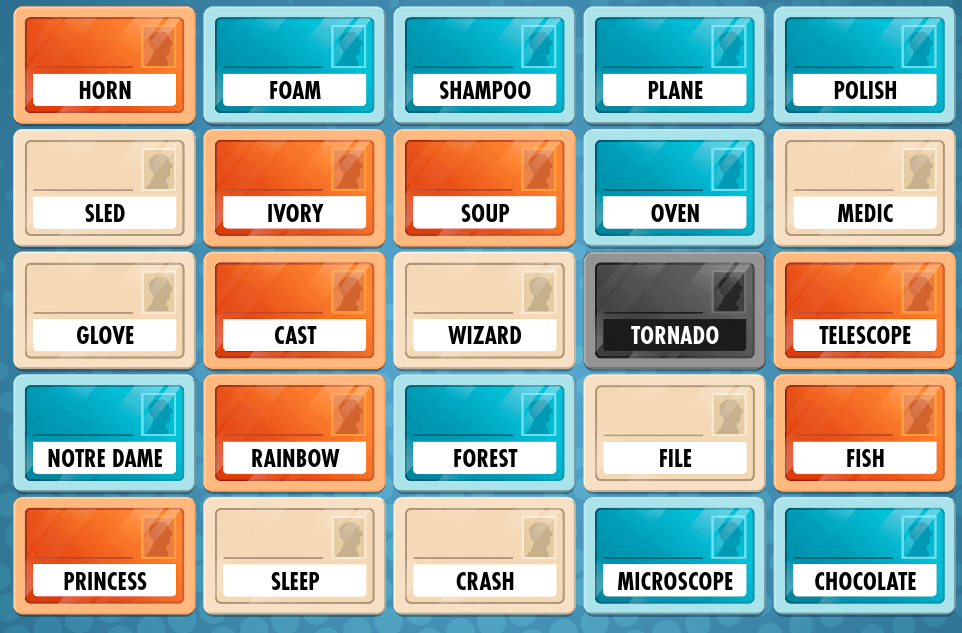

# Codenames solver



Think of a clue for the red player.

Done?

<details>
  <summary>Here are the clues suggested by this script:</summary>
    
    ```
    Found ball containing points: ['horn', 'ivory', 'soup', 'fish']
    Nearby words: ['ivory', 'fish', 'loup_de_mer', 'scallops', 'shrimp']
    ```

    The first two are useless (I keep them because eh), but the other three are reasonable clues.
</details>

The idea is that (sticking to greediness/discounting any complex strategic behaviour and assuming the players have similar minds) codenames can be approximately formulated as an "inverese k-nearest neighbours problem":

> Given two sets of words A and B, find the "A-largest" (i.e. consisting of the maximum number of words in A) ball with no words from B. Sample from close to the center of this ball.

We can solve this like: try to find a ball containing all points in A but no points in B; if that fails move on to $(|A|-1)$-combinations of A, ... until a solution is found.

Actually I do something less ambitious for "find a ball containing all points in A but no points in B" -- just use the bounding sphere of A and check if it is free of any points in B. You can imagine e.g. a point of B that is in the bounding sphere of A but you can exclude it by shifting the bounding sphere away while making it a bit larger -- in codenames this looks like changing a clue a bit to make it clear that some word is not to be excluded, at the expense of being a bit vaguer overall. We don't do this, but in practice this seems to work well enough.